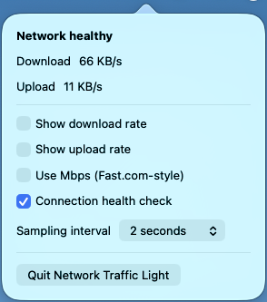

# Network Traffic Light

A local-only macOS menu-bar indicator for connection health and optional live
upload/download rates.

## Screenshots




## Requirements

- macOS 13+
- Xcode Command Line Tools with Swift 6

## Run during development

```bash
swift run NetworkTrafficLight
```

## Build an app bundle

```bash
./Scripts/build-app.sh
open build/NetworkTrafficLight.app
```

## How the indicator works

The menu-bar dot describes connection health:

- Green: macOS reports a usable network path and the latest health check
  succeeded.
- Yellow: a path exists, but the health check is pending or failed.
- Red: macOS reports no usable network path.
- Gray: the app is starting or resetting its sample baseline.

By default, only the dot is visible. Enable **Show download rate** and/or
**Show upload rate** from the popover to add live labels. Enable
**Use Mbps (Fast.com-style)** to show decimal megabits per second (`Mbps` or
`Gbps`) instead of the default byte-based rate.

### What the rates mean

The rates are aggregate traffic on the active primary network interface:

- **Download** is bytes received per second.
- **Upload** is bytes sent per second.
- The figures include every app and background service using that interface.

The app reads macOS's existing byte counters every two seconds by default,
calculates the change divided by elapsed time, then applies 50% smoothing to
avoid a flickering display. It does not capture packets, inspect their content,
or retain traffic history. The first sample after startup, wake, or an
interface change establishes a fresh baseline, so a rate may temporarily show
as unavailable.

### Network requests and privacy

Traffic measurement itself makes no network request. It only reads local
operating-system counters and requires neither administrator privileges nor
telemetry.

When **Connection health check** is enabled (the default), the app sends an
HTTPS `HEAD` request to:

`https://captive.apple.com/hotspot-detect.html`

It runs once when a usable path is detected and then at most once every
30 seconds, with a five-second timeout. `HEAD` requests ask for headers only,
not a response body. Disabling the setting stops these app-originated health
requests.

The code intentionally targets only that Apple endpoint. It does not disable
standard URL-session redirects or system proxy configuration, however, so a
network or proxy can relay or redirect the request.

## Verification

Run the self-contained checks with:

```bash
swift run NetworkTrafficLightChecks
```

The project uses these checks because the installed Command Line Tools do not
include XCTest or Swift Testing. The checks cover rate calculation and
formatting, primary-interface selection, traffic-light states, and sampler
baseline behavior.

- The default menu-bar item is a colour dot only.
- Upload and download labels can be enabled independently and persist.
- The app samples only the primary interface’s aggregate byte counters.
- Rates reset after an interface change until a valid delta exists.
- A health probe has a five-second timeout, runs no more than once per
  30 seconds when enabled, and does not run when disabled.
